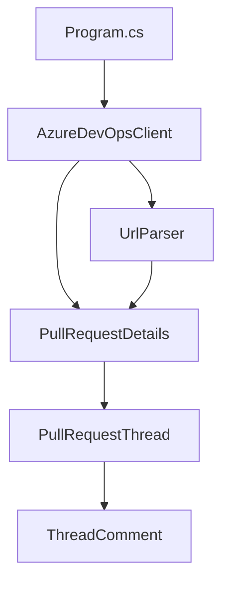

# System Patterns: Azure DevOps PR API Tester

## Architecture Overview
The application follows a clean separation of concerns with distinct components:



## Component Relationships
1. **Program.cs**
   - Entry point
   - Orchestrates the workflow
   - Handles command-line interactions

2. **Services/AzureDevOpsClient.cs**
   - Primary service for Azure DevOps API communication
   - Manages authentication and requests
   - Processes API responses

3. **Utils/UrlParser.cs**
   - Handles URL parsing logic
   - Extracts relevant information from Azure DevOps URLs
   - Validates URL formats

4. **Models**
   - **PullRequestDetails.cs**
     - Data model for pull request information
     - Encapsulates PR-related properties
     - Contains collection of threads
   - **PullRequestThread.cs**
     - Models for PR threads and comments
     - Represents discussion threads in PRs
     - Maintains comment history

## Design Patterns
1. **Client Pattern**
   - Encapsulated API communication
   - Clean interface for external services
   - Separation of API logic

2. **Utility Pattern**
   - Reusable URL parsing functionality
   - Stateless operations
   - Single responsibility

3. **Model Pattern**
   - Clear data representation
   - Type-safe property access
   - Separation of data structure

## Implementation Paths
1. URL Processing
   ```mermaid
   graph LR
       Input[URL Input] --> Parser[UrlParser]
       Parser --> Validation[Validate Format]
       Validation --> Extract[Extract Details]
       Extract --> Model[PR Details Model]
   ```

2. API Communication
   ```mermaid
   graph LR
       Client[API Client] --> Auth[Authentication]
       Auth --> Request[Make Request]
       Request --> Response[Process Response]
       Response --> Model[Update Model]
   ```

## Technical Decisions
1. Using .NET 8.0 for modern language features
2. Separating concerns into distinct classes
3. Implementing clean interfaces for maintainability
4. Using strong typing for PR details
